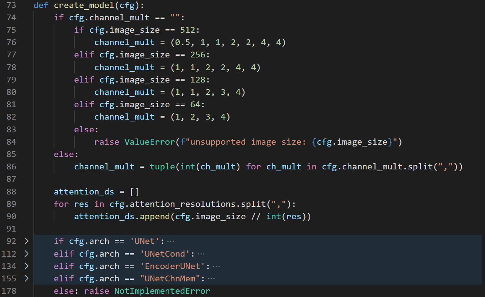

# guided-diffusion

This is the codebase for [Diffusion Models Beat GANS on Image Synthesis](http://arxiv.org/abs/2105.05233).

This repository is based on [openai/guided-diffusion](https://github.com/openai/guided-diffusion), with modifications many things.

# DDPM-Hash experiment
    $ git clone https://github.com/XezXey/guided-diffusion.git
    $ git checkout ddpm_hash

# Environment
    $ python3 -m venv <env_name>
    $ sudo apt-get install libopenmpi-dev
    $ python -m pip install --upgrade pip 
    $ pip install -r requirements.txt

# Run
    python train_scripts/image_train.py 
    --train.log_dir <path_to_save_model>
    --train.batch_size <batch_size>
    --cfg <path_to_cfg>
    --train.n_gpus <gpu_idx>

    [e.g.]
    python train_scripts/image_train.py 
    --train.log_dir /data/mint/model_logs/test_ddpm_chnmem 
    --train.batch_size 32 
    --cfg ./config/Uncondition_Image/baseline_64.yaml 
    --train.n_gpus "\\"0,\\""
Note : n.gpus params need to input this way to maintain 'str' data type (compat with yacs)

### Tensorboard Logs 
default logs directory is "./tb_logs"

# Config
Look into [base_config.py](./config/base_config.py) for all supported config.

# Add-on config for specific experiments
The config file can be overried from 2 ways
1. argparse (as the example above)
2. config file : Modified only the config you want to changed
For example : [baseline_64.yaml](./config/Uncondition_Image/baseline_64.yaml).

# Custom your own model(s)
There's 2 files to be modified.
1. guided_diffusion/models/*.py 
    - Add any network architecture into this file.
2. guided_diffusion/script_util.py. After add the model architecture, 
    - The config file should be modified by adding the cfg.arch == "\<your arch\>" 
    - img_model.arch in <config_file>.yaml
    

# Update logs & Features
Look into [update_logs.md](./update_logs.md)
    